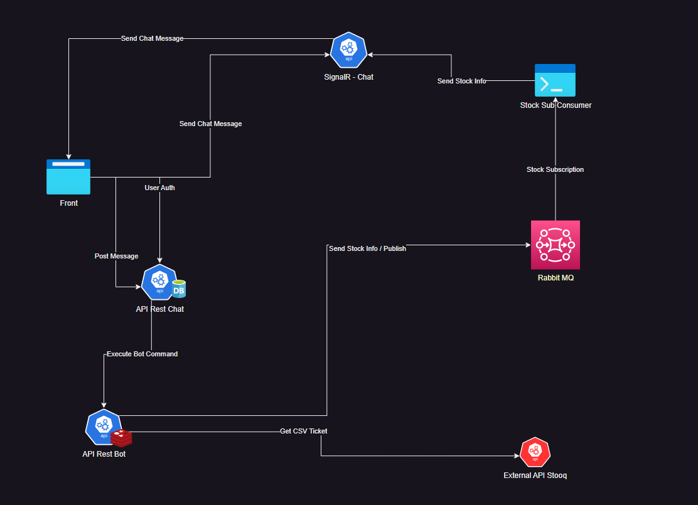

---

## Chat Challenge

This backend solution for Chat runs with Docker Compose File Witch is located in backend directory

Reference: https://www.docker.com

Commands

For build Images
```bash
$ docker-compose build
```

For Run Containers
```bash
$ docker-compose up
```


**Setup User for Auth In Backend:**

In Chat Service API you can locate swagger in URL: http://localhost:8000/swagger for all end-points description

For Login first you need to create new User after that you can post messages in chat.


**Front End:**

Front End is React App so you need to run it with npm.

Reference: https://nodejs.org/es

#### Components
- SignalR for real time update
- Rabbit MQ for sending Stock Price to Hub
- MongoDB for save chat history
- RedisDB for check valid Tickers


#### Libraries
- SignalR Core
- Rabbit MQ
- Redis StackExchange
- MongoDb Driver
- Swagger 
- Automapper
- XUnit
- Moq
- Fluent Validator